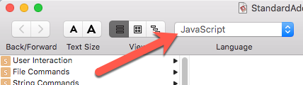
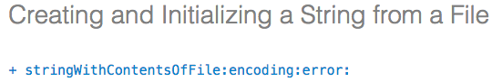

# JavaScript for Automation (JXA) Tips and Notes
I realized recently that I've acquired a vast but eclectic knowledgebase of information about using JXA. Unfortunately, this knowledgebase is in my head, and that's a terrible place for knowledge to go to die.

So I'm going to start trying to write it down, and only when I think of something, and I'm not too busy.

At the start, this is going to be highly disorganized - I'm just going to throw stuff in here. If I try to organize it at the start, I'll just put it off, and never write anything down. So instead, I'm just going to do it.

Please, please, please, if you have any more information to add, please report it as an issue and I'll try to incorporate it here, assuming I understand it, and care enough about the subject to include it.

## Resources
Just some of the resources I use, in no particular order:

* [Release Notes](https://developer.apple.com/library/mac/releasenotes/InterapplicationCommunication/RN-JavaScriptForAutomation/Articles/Introduction.html#//apple_ref/doc/uid/TP40014508-CH111-SW1)
* [JavaScript for Automation Cookbook](https://github.com/dtinth/JXA-Cookbook)
* [Mac Automation Scripting Guide](https://developer.apple.com/library/prerelease/content/documentation/LanguagesUtilities/Conceptual/MacAutomationScriptingGuide/index.html#//apple_ref/doc/uid/TP40016239)
* [Keyboard Maestro Forum](https://forum.keyboardmaestro.com/)

## includeStandardAdditions
```javascript
var app = Application.currentApplication();
app.includeStandardAdditions = true;
```
You can find out what "includeStandardAdditions" actually includes by opening its dictionary in Script Editor.
1. Run Script Editor.
2. Chose File->Open Dictionary...
3. Pick "StandardAdditions.osax".
4. Note that you can change the dictionary language to "JavaScript":


## Objective-C Bridge (ObjC) and NS method names
The naming convention that the JXA ObjC Bridge uses for NS objects can be confusing. Consider this example:
```javascript
var error = $(),
    str = ObjC.unwrap(
        $.NSString.stringWithContentsOfFileEncodingError(
            $(strPath)
            .stringByStandardizingPath,
            $.NSUTF8StringEncoding,
            error
        )
    );
```
What the hell is "stringWithContentsOfFileEncodingError"? Turns out, it actually makes some sense. Here's the Objective-C definition:


There it is, right in front of us. Just upper-case the first letter after each colon, then remove the colons.

```
stringWithContentsOfFile:encoding:error:
```

becomes

```javascript
stringWithContentsOfFileEncodingError
```

Near as I can tell, this convention is followed ruthlessly, although I'm sure *someone* will find a difference somewhere.

## [Atom Editor](https://atom.io/)
I *love* using the Atom editor for JXA work. However, it took me a while to get it set up correctly. Unfortunately I didn't document anything. So if anyone either has notes on the subject, or would like to be a guinea pig and work through this while documenting, post an Issue about it here and we can talk.

## Scripting Libraries
I finally managed to get JXA Scripting Libraries to work. The biggest problem is that you get a lot of "Error: No Error" messages. What these mean is that the script includes something that it doesn't allow. For example:

```javascript
// This is NOT ALLOWED in a Scripting Library
'use strict';
```
I haven't been able to figure out how to get the Module Pattern as eventually described [here](https://addyosmani.com/resources/essentialjsdesignpatterns/book/#modulepatternjavascript) to work from inside a Scripting Library.

And I have only been able to create scripts for the Scripting Library using Apple's Script Editor. Well, initially I create them in Atom, but I have to use Script Editor to save them before placing them in the Stripting Libraries folder.

I hope to post some examples in the future. If anyone's interested, let me know.