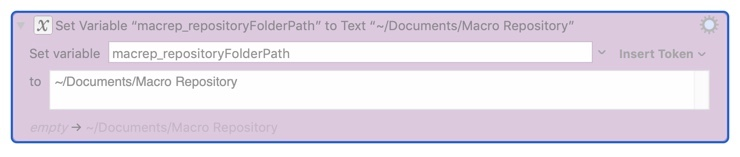
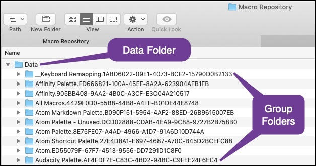
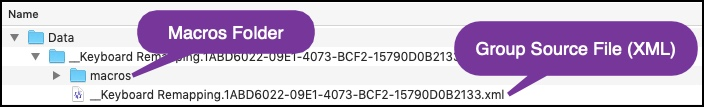
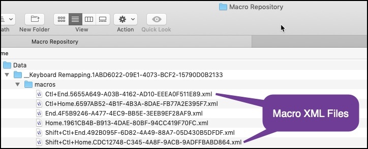
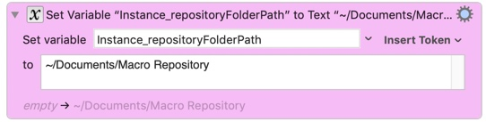
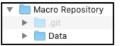

Repository Suite

# Macro Repository Suite v1.1.0

> **Requires [Keyboard Maestro](https://www.keyboardmaestro.com) v9 or higher.**
>
> Please report any bugs, on the **[Keyboard Maestro Forum](https://forum.keyboardmaestro.com/t/macro-repository-suite-backup-and-version-control-for-keyboard-maestro/15311)**. I can't fix it if I don't know about it!

# PURPOSE

Creates separate source files for each of your Groups and Macros, in a ***Repository Folder*** of your own choosing. This makes it easy to back them up, reload them if needed, and optionally place them under Version Control.

The **Macro Repository Suite** contains two Keyboard Maestro macros that are extremely easy to use:

## *Macro Repository Updater*

Saves all of your Groups and Macros to individual source files, in your ***Repository Folder***.

## *Macro Repository Importer*

Lets you select Group or Macro source files from the ***Repository Folder***, and import them back into Keyboard Maestro.

# License Agreement/Disclaimer:

I've tried my best to eliminate bugs, but nothing's perfect. So although I think this Suite works well, please be aware that something could go wrong, and I can't guarantee perfection.

```text
Copyright (c) 2019 Daniel Thomas

Permission to use, copy, modify, and/or distribute this
software for any purpose with or without fee is hereby
granted, provided that the above copyright notice and this
permission notice appear in all copies.

THE SOFTWARE IS PROVIDED "AS IS" AND THE AUTHOR DISCLAIMS
ALL WARRANTIES WITH REGARD TO THIS SOFTWARE INCLUDING ALL
IMPLIED WARRANTIES OF MERCHANTABILITY AND FITNESS. IN NO
EVENT SHALL THE AUTHOR BE LIABLE FOR ANY SPECIAL, DIRECT,
INDIRECT, OR CONSEQUENTIAL DAMAGES OR ANY DAMAGES
WHATSOEVER RESULTING FROM LOSS OF USE, DATA OR PROFITS,
WHETHER IN AN ACTION OF CONTRACT, NEGLIGENCE OR OTHER
TORTIOUS ACTION, ARISING OUT OF OR IN CONNECTION WITH THE
USE OR PERFORMANCE OF THIS SOFTWARE.
```

## CHANGES LOG
>
> **Requires Keyboard Maestro v9 or higher.**
>
> **v1.1.0 2019-09-16:**
> Added the variable Instance_saveAsJson, which lets you save source files as JSON instead of XML. Added links to the online documentation.
>
> **v1.0.2 2019-09-15:**
> Fixed an issue with "blank" Group names. Cleaned up some error-checking. Added the variable Instance_showLog.
>
> **v1.0.1 2019-09-13:**
> Added option to bypass the trash when deleting the Data folder.


# Installation

1. Download the .zip file from the [Keyboard Maestro Forum](https://forum.keyboardmaestro.com/t/macro-repository-suite-backup-and-version-control-for-keyboard-maestro/15311)
2. Unzip the contents, which will give you one ".kmmacros" file.
3. Double-click the ".kmmacros" file. This should cause Keyboard Maestro to import two macros into a group named "KM".

#### NOTES:

* You can rename the group, rename the macros, move them into another group, etc.
* The macros **don't** require any external files, unlike some of my other macros. But of course you'll need to create a ***Repository Folder***:

# Specifying Your Repository Folder

1. Create an empty folder to act as your ***Repository Folder***.
2. Change one Action in the **Macro Repository Updater** macro to point to your ***Repository Folder***, then *enable the Action*. The Action is the first magenta-colored Action in the macro, right at the top after the Comments. It looks like this:



#### NOTES:

* The folder must exist before running the **Macro Repository Updater** macro.
* It doesn't matter if you include a trailing slash or not.
* Don't forget to **enable the Action**.

# The Repository Folder

## File Names


Each file or folder is named starting with the name of the Group or Macro (purple bubble).

* If the name has characters that aren't valid in a file name, they're replaced with underscores ("_").
* Also, if the name starts with a period, an underscore is added to the front of the name. This is just to help eliminate any issues with hidden "." files.
* The extension will be either **.xml**, which is the default, or **.json** if you've selected that [option](#options).

Then the Group or Macro's **UUID** (unique identifier) is added to the end (blue bubble). This is to guarantee that the file names are unique.

## The Data Folder

Each time you run the **Macro Repository Updater** macro, a subfolder named ***Data*** is recreated inside your ***Repository Folder***, and it's filled with all the source files.

### The Group Folders



Inside the ***Data*** folder, there's a folder for each Group.

---

### The Group Source Files



Each Group folder has one [**XML** or **JSON**](#instance_saveasjson) file for the Group itself. If you ever want to re-import a ***Group***, you import this file first.

---

### The Macro Source Files



Inside each Group folder, there's a folder called ***macros***. It contains one [**XML** or **JSON**](#instance_saveasjson) file for each macro. When you want to re-import one or more ***Macros***, these are the files you select.

---

# Importing Groups and Macros from the Repository into KM

Use the **Macro Repository Importer** macro to import Groups or Macros.

The macro will lead you through the steps (they're easy), but here's a couple of notes:

1. You can only import one **Group** source file at a time.
2. You can import multiple **Macro** source files at a time.
   * You'll be asked to select the Group you want to import the Macros into.
   * The Macro source files don't know or care what Group they belong to, so you can import them into whatever group you want.

## Replacing Existing Groups or Macros

When you import a Group or Macro, it does **not** replace existing Groups or Macros. So you can end up with multiple Groups or Macros with the same name, which can be confusing. The easiest thing to do is delete the existing Group or Macro(s) first, before importing the ones from the **Repository**. You can use File->Export Macros before you delete them, if you want to be sure you can restore them if needed.

You could also just rename the existing Group or Macro(s) so you know which is which.

**BUT** if you want to replace existing Groups or Macros that are *referred to by other Macros*, you have to **delete the existing Group or Macros first**. Renaming is not good enough.

> **Technical Note:**
>
> Each KM Macro and Group has a unique identifier called a **UUID**. **UUID**s are used for a lot of things, but what's relevant here are the Actions that refer to other Macros and Groups. Here's a couple of common examples:
>
> * Execute a Macro
> * Set Macro or Group Enable
>
> So let's say you're using an **Execute a Macro** action somewhere, and it executes a macro called **Start Backups**. Internally, it doesn't store the macro name **Start Backups** - it stores the macro's **UUID**. That's so if you rename **Start Backups**, your **Execute a Macro** action still knows what macro to execute.
>
> Now let's say you messed up your **Start Backups** macro, and you need to import the old one from your **Repository** so you can undo what you messed up. If you leave the existing **Start Backups** macro in Keyboard Maestro, and you import the old **Start Backups** macro from the **Repository**, you're going to end up with two macros with the same **UUID**, and Keyboard Maestro won't let that happen.
>
> So Keyboard Maestro gives the the imported macro a **new UUID**. Which means if you delete the messed-up macro *after* importing the old version, your **Execute a Macro** action will **NOT** start using the newly imported macro. It doesn't know anything about it, because it has a different **UUID**.
>
> So what you really need to do is delete existing **Start Backups** macro ***before*** importing the old version from the **Repository**. That way Keyboard Maestro won't have to change its **UUID**, and your **Execute a Macro** action will still know what macro to execute.
>
> So as I said, if you want to replace existing Groups or Macros that are referred to by other Macros, you have to **delete the existing Group or Macros first**.

# Options

All the options you can specify are set in the **Macro Repository Updater** macro. There's 4 magenta-colored actions at the top, right after the opening comments.

They're all disabled by default. So to use them, you have to enable them.

## Instance_repositoryFolderPath



This first option isn't really optional - you **MUST** set it before running the macro, or the macro will display an error. See the [Specifying Your Repository Folder](#specifying-your-repository-folder) section for details.

## Instance_bypassTrash


Enable this option if you would rather have the **Macro Repository Updater** macro ***permanently delete*** the ***Data*** folder each time, instead of moving it to the trash.

I didn't enable this by default because I didn't want you to accidentally delete something important, by mistake. Once you've run the **Macro Repository Updater** macro a few times and are sure you entered the path to your ***Repository Folder*** correctly, you can enable this if you want.

#### Note:

Sometimes, even with this option enabled, the **Macro Repository Updater** macro will have to move your ***Data*** folder to the trash instead of permanently deleting it. It's an oddity in the OS/X file system I can't quite figure out.

>If any technically-minded people out there read this, the issue is that sometimes, if there's a **.DS_Store** file in the ***Data*** folder or one of its subfolders, `.NSFileManager.defaultManager.removeItemAtURL:Error` will generate a "permissions error" when I try to delete the ***Data*** folder. But not all the time. It's very strange. If you happen to have a solution, let me know.

## Instance_saveAsJson


Enable this option if you'd rather save the source files as JSON files instead of XML files.

What's the difference and why would you choose one over the other?

#### JSON files

**JSON** files are more compact, are easier for you to read, and most importantly, the "diff" viewers that many version control systems use will generally work better with **JSON** files than **XML** files. Most of the time, anyway.

#### XML Files

This is more-or-less the default source format for KM Groups and Macros. It's much more common to see **XML** source files than **JSON** files. And the process of importing an **XML** file into KM is much more widely understood than **JSON** files. So that's why it's the default.

# Version Control Systems (VCS)

## The Basics

As I mentioned previously, when you run the **Macro Repository Updater** macro, it creates a subfolder named ***Data*** inside your ***Repository Folder***.

If you want to use a VCS, place the ***Data*** folder under version control.

Let's say you're using **Git** for your VCS. Create a Git repository inside your ***Repository Folder***, and add the ***Data*** folder to the Git repository:



Each time you run the **Macro Repository Updater** macro, the ***Data*** folder is trashed (or deleted), re-created, and populated with all your source files.

So, after running the **Macro Repository Update**r macro, you can update your VCS if you want.

#### NOTE:

Make sure you use a VCS like **Git** that doesn't rely on file timestamps, but instead compares the actual file contents. Because every time the **Macro Repository Updater** macro is run, ALL the source files are recreated.
 
## About Version Control Systems

It's beyond the scope of this document to go into details about VC systems. If you want a tutorial, go to [https://git-scm.com/doc](https://git-scm.com/doc) and watch a video or two. Or search YouTube.

I personally recommend using **[SourceTree](https://www.sourcetreeapp.com)** which is a free GUI front-end for Git. Or just go to the **[Git website](https://git-scm.com)** and get started there.

## Git vs GitHub

"Git" is a command-line program that you run on your computer, and it creates and maintains a version control repository inside a folder. There are really good GUI programs to make using Git fairly easy, and I already recommended **[SourceTree](https://www.sourcetreeapp.com)**.

#### _"Git" is NOT the same as "GitHub"_

"Git" is the program that runs on your computer. "GitHub" is an online repository, usually for sharing code with others. You don't need to use GitHub unless you want to share your code with others.

You can, however, use the **[GitHub Desktop](https://desktop.github.com)** application as a GUI front-end for Git. Just remember that you don't want to have it use GitHub - you want local repositories only. Unless you actually *want* online repositories.

